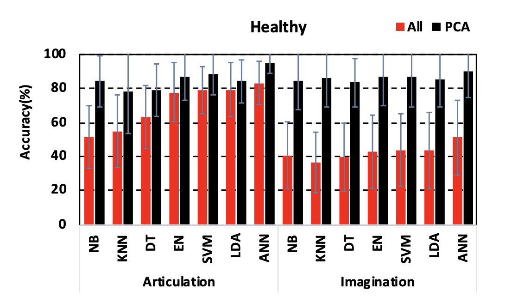
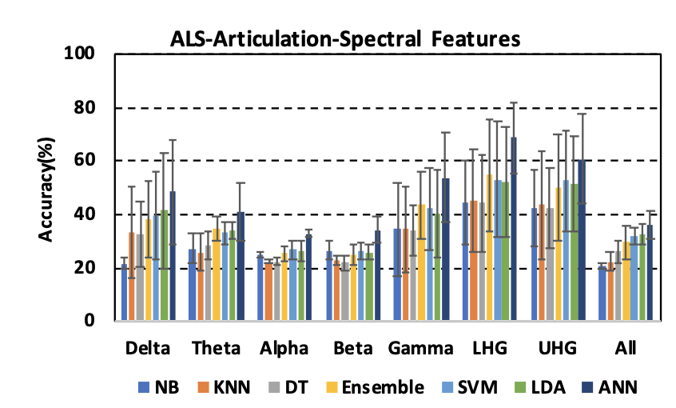

Data Replication
Keerthi Stanley


INTRO:

Premise-->

Broadly speaking, this paper is focusing on the concept of the Brain Computer Interface, and how it decodes speech based upon brain signals. This technology is particularly useful for those suffering from locked-in syndrome, as a result of severe neurological conditions such as Amyotrophic Lateral Sclerosis (ALS).

The study argues that magnetoencephalography (MEG) offers a promising improvement to BCI decoding in ALS patients than the current methods relying on electroencephalography (EEG) signals. 

Thus this study tests the decoding of spoken and imagined phrases from the MEG signals of ALS patients. It analyzes the bandpower of brainwaves (delta, theta, alpha, beta, and gamma) with 7 machine-learning decoders (Naive Bayes, K-nearest Neighbor, Decision Tree, Ensemble, Support Vector Machine, Linear Discriminant Analysis, and Artificial Neural Network)


Results-->

  - the decoding for ALS patients is lower than healthy subjects, yet significantly higher than chance subjects
  - the best results yield 75% accuracy for decoding imagined (covert) speech and 88% accuracy for spoken (overt) speech
  


OVERVIEW OF MY ANALYSES: using 5 articulation trials/phrases in an ALS patient, each trial analyzing across 204 MEG sensors

preprocessing of data:
1. setting sampling frequency for processing MEG data
2. creating a 4th order butterworth bandpass filter

bandpower analysis:
3. spectral feature extraction
  - creating a bandpower function
  - extracting values for individual bands
4. concatenating all spectral features (across bands)

statistical analysis/machine learning:
5. conducting PCA with concatenated data ---> DESCRIPTIVE STATS *extracts statistical features from population*
  - find standard deviation. proportion of variance, and cumulative proportion
  - choose principal components (PC's)
6. apply KNN machine learning algorithm --> INFERENTIAL STATS 

data visualization:
7. computing and visualizing accuracy of KNN model's beta band predictions--> DATA VISUALIZATION


last, but not least...
DISCUSSION/REFLECTIONS


----->


LOADING IN THE DATA

the raw data was processed then stored as a .mat file

in order to open this type of file in R, I could use the readMat() function from the {R.matlab} package:
https://cran.r-project.org/web/packages/R.matlab/R.matlab.pdf

HOWEVER, I originally tried that but the 3D array was too large to load the original .mat file


Original File Organization:
5 sets of  files for articulation and imagination each (ar1...ar5 and im1...im5) which are each 1x84 cell arrays

each cell represents and individual trial/phrase in the experiment

a single cell is actually a 204x3500 matrix, where the rows represent the 204 planar gradiometer sensors of the MEG and the columns represent magnetic field measurements at different time points

I used the following code in matlab to use one of these matrices and covert them to a csv file:
https://www.mathworks.com/help/matlab/ref/writematrix.html


EXAMPLE:
load('/Users/KeerthiStanley/Library/CloudStorage/Box-Box/WangLab/Data/MEGData/ALS Data/A001_Preprocessed.mat')

writematrix(ar1{1, 1}, 'ar1.csv')


The study focuses on both articulation and imagination in ALS patients and healthy participants


I am only working with 1 trial from each of the 5 phrases, in ALS ARTICULATION:

Loading in these newly created csv files:

Articulation- Phrase 1
```{r}
library(tidyverse)

f1 <- "https://raw.githubusercontent.com/keerthistan/data_analysis_rep_UPDATED/main/data/ar1.csv"

# there is no labeling of the columns, so col_names = FALSE
d1 <- read_csv(f1, col_names = FALSE)

# convert data to numeric matrix
d1 <- as.matrix(d1)
d1 <- apply(d1, 2, as.numeric)

```

Articulation- Phrase 2
```{r}
library(tidyverse)

f2 <- "https://raw.githubusercontent.com/keerthistan/data_analysis_rep_UPDATED/main/data/ar2.csv"

# there is no labeling of the columns, so col_names = FALSE
d2 <- read_csv(f2, col_names = FALSE)

# convert data to numeric matrix
d2 <- as.matrix(d2)
d2 <- apply(d2, 2, as.numeric)

```

Articulation- Phrase 3
```{r}
library(tidyverse)

f3 <- "https://raw.githubusercontent.com/keerthistan/data_analysis_rep_UPDATED/main/data/ar3.csv"

# there is no labeling of the columns, so col_names = FALSE
d3 <- read_csv(f3, col_names = FALSE)

# convert data to numeric matrix
d3 <- as.matrix(d3)
d3 <- apply(d3, 2, as.numeric)

```

Articulation- Phrase 4
```{r}
library(tidyverse)

f4 <- "https://raw.githubusercontent.com/keerthistan/data_analysis_rep_UPDATED/main/data/ar4.csv"

# there is no labeling of the columns, so col_names = FALSE
d4 <- read_csv(f4, col_names = FALSE)

# convert data to numeric matrix
d4 <- as.matrix(d4)
d4 <- apply(d4, 2, as.numeric)
```

Articulation- Phrase 5
```{r}
library(tidyverse)

f5 <- "https://raw.githubusercontent.com/keerthistan/data_analysis_rep_UPDATED/main/data/ar5.csv"

# there is no labeling of the columns, so col_names = FALSE
d5 <- read_csv(f5, col_names = FALSE)

# convert data to numeric matrix
d5 <- as.matrix(d5)
d5 <- apply(d5, 2, as.numeric)
```


show the first few lines of data:

head() function documentation-
https://www.digitalocean.com/community/tutorials/head-and-tail-function-r

this shows us the first 10 rows (A.K.A sensors) and 5 columns (time points when MEG measurements were taken)
```{r}
# [row, columns]
# start index : stop index --> R has base index of 1
d1_head <- d1[1:10, 1:5]

print(d1_head)
```


DATA REPLICATION / VISUALIZATION


PREPROCESSING:

* UPDATE-> after speaking to the author of the paper recently, he mentioned that the dataset I received already underwent preprocessing. thus the code below is more for educational purposes, but I will be using the original datasets I uploaded for the rest of analyses, not the filtered version


1. Defining the sampling frequency at 1000 Hz, determined a priori
```{r}
Fs <- 1000
```

2. Creating a Butterworth Bandpass Filter: this is the standard filter (allows filtration without too many modifications to the signal pattern itself) used by my lab to filter out unrelated noise from MEG datasets. I was instructed by my PI to filter signals outside the range of 0.1-250 Hz

The paper clarifies that Dash also used a 4th order butterworth filter, but stated he used a lowpass filter with a cutoff od 250 Hz, rather than the bandpass filter I used.


** documentation for t():
https://www.rdocumentation.org/packages/base/versions/3.6.2/topics/t
```{r}
library(signal)

# filter order
filterOrder <- 4;

# bounds of bandpass filter
lowFreq <- 0.1;
highFreq <- 250;

# need to normalize the cutoff bounds by dividing by the Nyquist frequency
# and the Nyquist frequency is 1/2 of the sampling frequency (Fs=1000, as I stated before) 
norm_freq_cutoff <- c(lowFreq, highFreq) / (Fs / 2) 

# creating the butterworth filter, using butter() from {signal}
bandpass_filter <- butter(filterOrder, norm_freq_cutoff, type = "pass")


# initially when applying the filter it would change the dimensions of my data set
# so I'm using t() which is the transpose matrix function:
d1_filter <- t(apply(d1, 1, function(row) filter(bandpass_filter, row)))
```


so I can visually inspect the filtered data and confirm it has maintained the right dimensions
```{r}
View(as.data.frame(d1_filter))

dim(d1_filter)
```


BANDPOWER ANALYSIS:


The paper says:
"The spectral features were extracted from each of the 196 radiometer signals for each trial... 
We also performed the decoding analysis by concatenating all the spectral features as the input to the decoders, considering the high dimension of sensor and feature concatenation, we performed PCA on all the concatenated features, and reduced the feature dimension to a 90% variance threshold."


IMPORTANT NOTE!!!!!!!! : 
In the paper Dash used 196 of the 204 total sensors, so that he could obtain a perfect square. However, as I was unable to identify the specific sensors Dash used and why he selected them, my PI instructed that I use all 204 sensors.


3. Spectral Feature Extraction

Matlab has great videos for understanding and implementing the FFT (fast fourier transform) and finding PSD (power spectral density), such as this one:

https://www.youtube.com/watch?v=pfjiwxhqd1M


FFT- R documentation:
https://rpubs.com/raulvalerio/intro_fourier_in_R


first I should define the frequency bands, with the bounds specified by Dash in the paper:
as you can see I commented out Delta; while used in the study, my PI informed me that since it is mainly associated with sleep, I should omit Delta and focus on the other bands for now
```{r}
frequencyBands <- list(
  # Delta = c(0.3, 4),
  Theta = c(4, 8),
  Alpha = c(8, 15),
  Beta = c(15, 30),
  Gamma = c(30, 59),
  Lower_HighGamma = c(61, 119),
  Upper_HighGamma = c(121, 250)
)
```

now creating a new function to calculate the bandpower of the signal using the Fast Fourier Transform (FFT)


this step of the experiment requires a solid understanding of Digital Signal Processing (DSP):

terms to know:
BAND--> a specific range of frequencies, in this case it distinguishes different type of brainwaves
  as shown above, we are extracting delta, theta, alpha, beta, gamma, and high gamma bands
  
BANDPOWER--> condense the PSD to give insight into strength of signal in a particular band


  - FFT is a method to find the Discrete Fourier Transform of a signal, which takes in the original (time-domain) signal and outputs a frequency-domain signal
  
  
great help for computation of psd based on fft:
https://dsp.stackexchange.com/questions/25456/conversion-of-fft-to-psd

psd = abs(fft) * (2/n), where n is the spacing of the frequency


the which() function:
specifies the index values for requested items from a logical vector(does the item meet the stated condition, TRUE or FALSE)

documentation- https://www.geeksforgeeks.org/which-function-in-r/
 
Creating bandpower function 
```{r}

# function where the input is signal and the frequency bounds of the bandpower
bandpower_funct <- function(signal, freq_low, freq_high) {
  # how many data points are in the signal?
  n <- length(signal)
  # using the built-in fft function in R
  fft_res <- fft(signal)
  # data indices should correspond to respective frequency value
  # sampling frequency, Fs, is split into, n, evenly spaced 'bins'--> (Fs/n)
  freq_val <- (0:(n-1)) * (Fs / n)
  # calculate power spectral density (PSD)
  psd <- abs(fft_res)^2 / n
  # which() to pick out indices for values that fit the criteria
  # the criteria: frequencies between the low and high bounds for the given band
  band_indices <- which(freq_val >= freq_low & freq_val <= freq_high)
  # CALCULATE BANDPOWER
  # sum as the psd values for the matrices then divide by the number of data points
  bandpower <- sum(psd[band_indices]) / length(band_indices)
  return(bandpower)
}

```


Storing extracted bandpower values

art1: (Articulation- Phrase 1)
```{r}
# store bandpower values for each band into a list
art1_bandpowers <- list()

# d_filter is a matrix where each row is a sensor and each column is a time point
# we want to find the bandpower for each band and each sensor

# for each iteration/band in the frequencyBands list created before
for(band in names(frequencyBands)) {
  band_low <- frequencyBands[[band]][1] # first value is lower bound for respective band
  band_high <- frequencyBands[[band]][2] # second value is upper bound
  
  # creating a matrix to store the resulting bandpower values
  # as many rows as there are sensors/rows in d_filter, and 1 column --> this goes for each pass(band)
  art1_band_matrix <- matrix(nrow=nrow(d1), ncol=1)
  
  # for each sensor pass all the way through the end of the rows(the last sensor in d_filter)
  for(sensor_idx in 1:nrow(d1)) {
    # apply the bandpower function and assign to the band_matrix
    art1_band_matrix[sensor_idx, 1] <- bandpower_funct(d1[sensor_idx, ], band_low, band_high)
  }
  
  # now store all the bandpower values
  art1_bandpowers[[band]] <- art1_band_matrix
}


# You can access the bandpower values for a specific band like so: art1_bandpowers[["Alpha"]]
```

art2 bandpowers
```{r}
# store bandpower values for each band into a list
art2_bandpowers <- list()

# d_filter is a matrix where each row is a sensor and each column is a time point
# we want to find the bandpower for each band and each sensor

# for each iteration/band in the frequencyBands list created before
for(band in names(frequencyBands)) {
  band_low <- frequencyBands[[band]][1] # first value is lower bound for respective band
  band_high <- frequencyBands[[band]][2] # second value is upper bound
  
  # creating a matrix to store the resulting bandpower values
  # as many rows as there are sensors/rows in d_filter, and 1 column --> this goes for each pass(band)
  art2_band_matrix <- matrix(nrow=nrow(d2), ncol=1)
  
  # for each sensor pass all the way through the end of the rows(the last sensor in d_filter)
  for(sensor_idx in 1:nrow(d2)) {
    # apply the bandpower function and assign to the band_matrix
    art2_band_matrix[sensor_idx, 1] <- bandpower_funct(d2[sensor_idx, ], band_low, band_high)
  }
  
  # now store all the bandpower values
  art2_bandpowers[[band]] <- art2_band_matrix
}


# You can access the bandpower values for a specific band like so: art2_bandpowers[["Alpha"]]
```


art3 bandpowers:
```{r}
# store bandpower values for each band into a list
art3_bandpowers <- list()

# d_filter is a matrix where each row is a sensor and each column is a time point
# we want to find the bandpower for each band and each sensor

# for each iteration/band in the frequencyBands list created before
for(band in names(frequencyBands)) {
  band_low <- frequencyBands[[band]][1] # first value is lower bound for respective band
  band_high <- frequencyBands[[band]][2] # second value is upper bound
  
  # creating a matrix to store the resulting bandpower values
  # as many rows as there are sensors/rows in d_filter, and 1 column --> this goes for each pass(band)
  art3_band_matrix <- matrix(nrow=nrow(d3), ncol=1)
  
  # for each sensor pass all the way through the end of the rows(the last sensor in d_filter)
  for(sensor_idx in 1:nrow(d3)) {
    # apply the bandpower function and assign to the band_matrix
    art3_band_matrix[sensor_idx, 1] <- bandpower_funct(d3[sensor_idx, ], band_low, band_high)
  }
  
  # now store all the bandpower values
  art3_bandpowers[[band]] <- art3_band_matrix
}


# You can access the bandpower values for a specific band like so: art3_bandpowers[["Alpha"]]
```

art 4
```{r}
# store bandpower values for each band into a list
art4_bandpowers <- list()

# d_filter is a matrix where each row is a sensor and each column is a time point
# we want to find the bandpower for each band and each sensor

# for each iteration/band in the frequencyBands list created before
for(band in names(frequencyBands)) {
  band_low <- frequencyBands[[band]][1] # first value is lower bound for respective band
  band_high <- frequencyBands[[band]][2] # second value is upper bound
  
  # creating a matrix to store the resulting bandpower values
  # as many rows as there are sensors/rows in d_filter, and 1 column --> this goes for each pass(band)
  art4_band_matrix <- matrix(nrow=nrow(d4), ncol=1)
  
  # for each sensor pass all the way through the end of the rows(the last sensor in d_filter)
  for(sensor_idx in 1:nrow(d4)) {
    # apply the bandpower function and assign to the band_matrix
    art4_band_matrix[sensor_idx, 1] <- bandpower_funct(d4[sensor_idx, ], band_low, band_high)
  }
  
  # now store all the bandpower values
  art4_bandpowers[[band]] <- art4_band_matrix
}


# You can access the bandpower values for a specific band like so: art4_bandpowers[["Alpha"]]
```

art5
```{r}
# store bandpower values for each band into a list
art5_bandpowers <- list()

# d_filter is a matrix where each row is a sensor and each column is a time point
# we want to find the bandpower for each band and each sensor

# for each iteration/band in the frequencyBands list created before
for(band in names(frequencyBands)) {
  band_low <- frequencyBands[[band]][1] # first value is lower bound for respective band
  band_high <- frequencyBands[[band]][2] # second value is upper bound
  
  # creating a matrix to store the resulting bandpower values
  # as many rows as there are sensors/rows in d_filter, and 1 column --> this goes for each pass(band)
  art5_band_matrix <- matrix(nrow=nrow(d5), ncol=1)
  
  # for each sensor pass all the way through the end of the rows(the last sensor in d_filter)
  for(sensor_idx in 1:nrow(d5)) {
    # apply the bandpower function and assign to the band_matrix
    art5_band_matrix[sensor_idx, 1] <- bandpower_funct(d5[sensor_idx, ], band_low, band_high)
  }
  
  # now store all the bandpower values
  art5_bandpowers[[band]] <- art5_band_matrix
}


# You can access the bandpower values for a specific band like so: art5_bandpowers[["Alpha"]]
```


Now we have all the bandpowers extracted and stored for each sensor (gradiometers 1 through 204) and each band (Alpha, Theta, etc...)


***IMPORTANT***

How to access the results?

call which band you want to get the values for:

  
example with code input and output:    

> print(art1_bandpowers[["Theta"]])

(this will print out the theta band values for each of the 204 sensors, in the articulation phrase 1 data)

however, this looked really cluttered when rendered, so I'm not showing the output here


4. Concatenating All Spectral Features and Separating Bands Into Individual Data Structures

In the paper, the results are posted as a single measure of percent accuracy for each band, as well as percent accuracy for the concatenated data ("All" in the paper) 

so we need to concatenate the features in order to move on to the decoding step

"We also performed the decoding analysis by concatenating all the spectral features as the input to the decoders"

-using cbind() to concatenate the data

Concatenated data:
```{r}
# a list of ALL the bandpowers from across the 5 different articulation phrases
all_art_bandpowers <- list(art1_bandpowers, art2_bandpowers, art3_bandpowers, art4_bandpowers, art5_bandpowers)

# empty list that will come to store 
art_concatenated <- list()

# using cbind() in the for loop to concatenate data from each band
for (i in 1:length(all_art_bandpowers)) {
  concatenated_data <- cbind(all_art_bandpowers[[i]][["Theta"]],
                             all_art_bandpowers[[i]][["Alpha"]],
                             all_art_bandpowers[[i]][["Beta"]],
                             all_art_bandpowers[[i]][["Gamma"]],
                             all_art_bandpowers[[i]][["Lower_HighGamma"]],
                             all_art_bandpowers[[i]][["Upper_HighGamma"]])
  
  # naming the columns after the bands
  colnames(concatenated_data) <- c("Theta", "Alpha", "Beta", "Gamma", "Lower_HighGamma", "Upper_HighGamma")
  
  # storing all the concatenated data in the list created earlier
  art_concatenated[[i]] <- concatenated_data
}

```


if you want to view each phrase's data in more detail you can use the View() function to do so

EX: viewing the first phrase's (art1) combined bandpower for each band and sensor:

> (View(art_concatenated[[1]]))


...or view them all by just calling on the art_concatenated list:

> art_concatenated


however, once again, this looked very cluttered when rendered, so I'm not actually including this in my code


5. PCA on Concatenated Data- DESCRIPTIVE STATISTICAL ANALYSIS

The paper mentions "considering the high dimension of sensor and feature concatenation, we performed PCA on all the concatenated features, and reduced the feature dimension to a 90% variance threshold."

because this is a larger dataset, they used Principal Component Analysis (PCA); this process allows us to REDUCE DIMENSIONALITY while still PRESERVING SIGNIFICANT TRENDS in the data overall
    - in this case, the paper instructs us to choose the principal components that represent 90% of the dataset's variance/spread
    

PCA is also considered a part of descriptive statistical analysis as it gives statistical features of the current, existing dataset


in the paper the original data was first plugged into the machine learning models AND THEN the accuracy with the original data was compared to the accuracy when the post-PCA data was plugged into the same ML models


-I will be using the prcomp() function from {stats} to programmatically compute the pca


really good article for a step-by-step conceptual walkthrough of PCA:
https://builtin.com/data-science/step-step-explanation-principal-component-analysis


step 1- standardize the data

for each variable, subtract the value minue the mean, then divided by the standard deviation

standardize value = (value - mean)/standard deviation
```{r}
# creating a function
# takes data as input, and returns the standardized value of the data
standardize_data <- function(data) {
  return((data - mean(data, na.rm = TRUE)) / sd(data, na.rm = TRUE))
}
```

since art_concatenated is classified as a list, I can now use the lapply() function to apply the function across the list

standardize the concatenated data
```{r}
# x is each element of the list
# apply the standardize_data function to each column (band) in x
art_concatenated_standardized <- lapply(art_concatenated, function(x) apply(x, 2, standardize_data))
```

each band was standardized separately to account for the fact that different bands (theta, delta, alpha, etc...)
operate on different values/scales


tutorial on some of this code: https://www.datacamp.com/tutorial/pca-analysis-r

  - I need {corrr} and {ggcorrplot}
  
  
step 2- correlation matrix:
```{r}
library(corrr)
library(ggcorrplot)

# FUNCTION CREATION
# create function to compute and plot correlation matrix for each standardized dataset
plot_corr_matrix <- function(data, title) {
  # compute the correlation matrix
  corr_matrix <- cor(data)

  # plotting correlation matrix using {ggcorrplot}
  ggcorrplot(corr_matrix, title = title, lab = TRUE)
}


# APPLYING FUNCTION TO NORMALIZED CONCATENATED DATA LIST
# once again using lapply() for this
# seq_along(): assigns sequence of numbers to each element of the list
(lapply(seq_along(art_concatenated_standardized), function(i) {
  plot_corr_matrix(art_concatenated_standardized[[i]], paste("Correlation Matrix for Articulation Phrase", i))
}))

```


interpreting the correlation matrix:
  - the range of this is -1 to 1; the higher numbers (more red squares) indicate a HIGH level of correlation between 2 variables
      - for example, the high correlation between Gamma and Lower High Gamma (LHG) noticed across the all 5 phrases
  - the more white range (around 0), indicates little to no correlation and the blue (closer to -1) indicates anticorrelation
      - for example, in phrase 5, there seems to be very little correlation (0.14) between theta and LHG, especially when compared with some of the other phrases
  - high correlation can indicate redundancy in the data, and allows us to see interactions in our dataset prior to conducting PCA


step  3- perform pca and print the output summary
```{r}
# need the {stats} package for this
library(stats)
# apply pca with prcomp() function
# no need to center/scale be we already did by standardizing
pca_results <- lapply(art_concatenated_standardized, function(x) prcomp(x, center = FALSE, scale. = FALSE))  

(summary(pca_results))
```
we see each individual articulation phrase is it's own list, so I need to use lapply() once again to print out a thorough PCA summary for each phrase
```{r}
(lapply(pca_results, summary))
```

The PCA tells us 3 things:
  1. Standard Deviation- how spread is the data within each principal component (PC)?


  2. Proportion of Variance- what percentage of variance does each band account for individually?
for instance, we see that the PC1 of art1 composes 67.15% of the variance

manually calculated: std^2 / sum(std^2)

  3. Cumulative Proportion- adds up in the proportions of variance to obtain a total variance threshold at each stage
  
we use this to determine which PC's fall under the specified variance threshold (in this case, 90%)


looking at the Cumulative proportion I can find the number of PC's needed for each phrase to just pass the 90% variance threshold:

ART1: PC1, PC2, and PC3 (3 PC's)

ART2: PC1, PC2, PC3, and PC4 (4 PC's)

ART3: PC1, PC2, and PC3 (3 PC's)

ART4: PC1, PC2, and PC3 (3 PC's)

ART5: PC1, PC2, PC3, and PC4 (4 PC's)


```{r}
threshold <- 0.9  # variance threshold at 90%

# make function to extract PC's that meet the variance threshold, with the results
extract_principal_components <- function(pca_result, threshold) {
  # manually computing the cumulative variance
  var_explained <- pca_result$sdev^2 / sum(pca_result$sdev^2)
  cumulative_variance <- cumsum(var_explained)
  
  # number of components correspond to when the cumulation variance is greater than or equal to 90% (threshold)
  num_components <- which(cumulative_variance >= threshold)[1]
  
  # return the principal components up to that number
  return(pca_result$x[, 1:num_components])
}

# apply function
# creates a list with 5 smaller structures for each articulation phrase
  # 204 sensors/rows, with columns corresponding to the number of accepted PC's
pcs_kept <- lapply(pca_results, extract_principal_components, threshold)
```

if you want to see the fully displayed pc's then you can program:
> pcs_kept

however, I will not be printing these, as they are very long when rendered


In the paper, Dash created two different versions of the concatenated data. One was from the original, pre-PCA data and the other was post-PCA, only using the PC's needed to meet the 90% variance threshold. He then compared their accuracy across different machine learning algorithms, While I am not doing this specific visualization from the paper, I wanted to show how PCA uses descriptive stats such as standard deviation and proportion of variance, to select ideal principal components, that will reduce dimensionality while maintaining the important trends/relationships of the data.


copying path from the images folder of the repository:



6. Applying the KNN Machine Learning Algorithm for Regression Analysis- INFERENTIAL STATISTICS

(while these is not quite the same as the inferential statistical techniques discussed, Dr. DiFiore mentioned that designing/using a KNN model can count towards this requirement because I am using samples of the data to make inferences/predictions)


The paper uses multiple different machine learning algorithms; for the visualization, I will just be using one: K-Nearest Neighbors (KNN)

the paper says that it "was designed with a K value of 5 and Euclidean distance metric"
  - Euclidean distance metric is default with the package I'll be using
  - but I will remember to specify that K=5!

KNN is relatively simple machine learning algorithm, which perhaps explains why KNN did not perform with super high accuracy in both ALS and Healthy Articulation experiments.


Some facts about KNN:

- in this case, to memorize how the MEG data corresponds to each of the 5 phrases and sort them out correctly by phrase--> Classification (seeks to classify the MEG features corresponsing to different phrases)

- it essentially memorizes the dataset
  - then to make a prediction, it looks for the closest observations in the training set, based on its distance metric
      --> the K-value is how many 'neighbors' it bases it's classification off of


* NOTE- the paper first used the original (pre-PCA) concatenated data to input into the ML models and determine accuracy, so that is what I will be doing here as well

    - so the data being plugged in should be art_concatenated


using methodology for KNN (with some sample code):
https://www.datacamp.com/tutorial/k-nearest-neighbors-knn-classification-with-r-tutorial


part 1- converting concatenated data into a dataframe that can be processed by KNN    
```{r}
library(tidyverse)

# convert each matrix (for each phrase) to data frames and add a phrase label
# lapply, because art_concatenated is a list
art_data_frames <- lapply(seq_along(art_concatenated), function(i) {
  data_frame <- as.data.frame(art_concatenated[[i]])
  # labeling each phrase with it's numeric label
  data_frame$Phrase <- paste("Phrase", i)
  return(data_frame)
})

# combine all 5 data frames from each phrase into one dataframe, with phrase classification listed in a separate column
art_full_data <- bind_rows(art_data_frames)
```


shuffle the data:
```{r}
set.seed(123)  # will only get the SAME random drawing each time, so others can reproduce these same splits/results

# sample() function shuffles rows of a dataset, in this case the rows are the sensor numbers, as well as the phrase classifications
# columns stay the same, split into different bands
shuffle_art_full_data <- art_full_data[sample(nrow(art_full_data)), ]

# showing a few lines so you can see how the data has been shuffled
(head(shuffle_art_full_data))
```


cross validation- splitting into training and test sets
  - this code is inspired by the KNN datacamp article documentation linked above
```{r}
library(caTools) # will need this package

# using sample.split() to split the data, into 80% and 20% sets (this ratio is arbitrary, just chose this split because it's somewhat standard/common)
split <- sample.split(shuffle_art_full_data$Phrase, SplitRatio = 0.80)

# create training and testing datasets (with 80 % going into the training set, and the remaining 20% going into the test set)
train <- subset(art_full_data, split == TRUE)
test <- subset(art_full_data, split == FALSE)
```


"Phrase"--> the specific articulation phrase out of our 5 different phrases, is considered the target VARIABLE or LABEL

the FEATURES refer to all the other columns, or bands (Theta, Alpha, Beta, etc...)


feature scaling- necessary because KNN is calculating the distance between various data points
should scale all the features to have mean = 0 and std = 1
should NOT scale the target variable, so the column with Phrase should be excluding

using the scale() function from the KNN documentation I listed earlier
```{r}
# using scale() to scale both the training and testing sets
# excludes the final column, Phrase
train_scaled = scale(train[-ncol(train)])
test_scaled = scale(test[-ncol(test)])


# checking the scaled data, we can see that it properly excluded the Phrase column
head(train_scaled)

head(test_scaled)
```

training the knn model
using the knn() function from the {class} package

using K value of 5, as the paper lists
```{r}
library(class)
test_pred <- knn(
                 train = train_scaled, 
                 test = test_scaled,
                 cl = train$Phrase, # the knn should classify the data according to which phrase it belongs to
                 k=5 # according to the paper
                 )
```


to evaluate the model, I need to create a confusion matrix!!
once again using the data camp documention from Data Camp to construct this code
 
```{r}
# to gauge how accurate the model is, I need to compare with the actual values from the test/validation set
# drawing out Phrase from the test set, as it is our label/target
actual <- test$Phrase

# create and display the Confusion Matrix (cm)
(cm <- table(actual,test_pred))
```
determine accuracy of knn model
    - to calculate accuracy: sum the diagonal values of the confusion matrix (when the test prediction)
```{r}
accuracy <- sum(diag(cm))/length(actual)
sprintf("Accuracy: %.2f%%", accuracy*100)
```


DATA VISUALIZATION: plotting the accuracy of the KNN model for the concatenated data

```{r}
# using ggplot
library(ggplot2)

# converting to data frame for plotting
accuracy_data <- data.frame(
  Category = "All",  # all of the data, not individual bands
  Accuracy = accuracy * 100  # convert to percentage
)

# PLOTTING
ggplot(accuracy_data, aes(x = Category, y = Accuracy)) +
  geom_bar(stat = "identity", fill = "orange") +  # 'identity' to use the heights of the data, filling it orange to match the paper's color for KNN
  labs(title = "KNN Classification Accuracy for ALS Articulation Decoding", 
       x = "Spectral Features", 
       y = "Accuracy (%)") +
  coord_cartesian(ylim = c(0, 100)) +  # setting limits for the y-axis to match the fact that it's a percentage
  scale_y_continuous(breaks = seq(0, 100, by = 20)) +  # setting the y-axis to match the increments of the paper
  theme_minimal()  
```
Let's compare to the actual value for KNN accuracy shown in the paper for ALS articulation! 

As we can see in the plot below, under "All" if we look at the accuracy of the KNN model (in orange), it is around 21-22%, which is almost exactly the value that I have obtained here!




NOT COMPLETE!!!!


